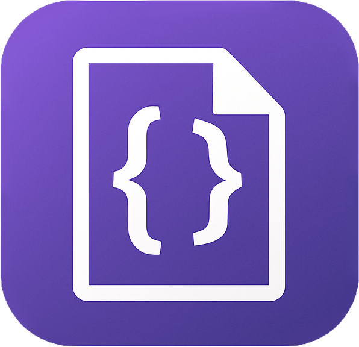

# Prettiest — Vintage Story JSON Formatter

<p align="center">
  
</p>

<p align="center">
  <a href="#installation"></a>
  <a href="#system-requirements"></a>
  <a href="#license--credits"></a>
</p>

A fast, desktop GUI for formatting and validating **Vintage Story JSON** (Newtonsoft relaxed JSON; often called *“JSON with comments”*). It preserves comments, highlights important VS keys, detects common mistakes (with optional auto-fix), and stays smooth on large files with visible-range highlighting.

> **Why?** Vintage Story uses Newtonsoft’s relaxed JSON parser, which supports things normal JSON does not: comments (`//`, `/* */`), trailing commas, unquoted keys, and multiple top-level values. Prettiest understands these quirks so you can edit VS assets comfortably.

> **Note on terminology:** Some communities call this **JSONC (JSON with Comments)**. In this README, *Vintage Story JSON* and *JSON with comments* both refer to this relaxed Newtonsoft format — not the official JSONC spec.

---

## Table of Contents
- [Features](#features)
- [System Requirements](#system-requirements)
- [Installation](#installation)
- [Quick Start](#quick-start)
- [The Interface](#the-interface)
- [Formatting Behavior](#formatting-behavior)
- [Error & Warning Tools](#error--warning-tools)
- [Quotes Toggle](#quotes-toggle)
- [Syntax Highlighting](#syntax-highlighting)
- [Shortcuts](#shortcuts)
- [Troubleshooting](#troubleshooting)
- [Project Structure](#project-structure)
- [License & Credits](#license--credits)

---

## Features
- **One-click formatting** for VS JSON.
- **Preserves comments** and VS allowances.
- **Highlights important VS keys** (`attributes`, `textures`, `shape`, `elements`, etc.).
- **Visible-range highlighting** (fast even on huge files).
- **Configurable line width** and **header threshold**.
- **Error check with auto-fix** for missing commas.
- **Warnings** for unquoted keys, trailing commas, multiple root values.
- **Quote toggle** (quote/unquote keys & values).
- **Copy/Paste/Open/Save** with robust clipboard support.
- **Dark UI** with resizable font scale.

---

## System Requirements
- **OS:** Windows 10/11, macOS 12+, Linux desktop.
- **Python (for source only):** 3.9+
- **Dependencies (for source only):**
  - `customtkinter`
  - `pyperclip`
  - `pillow`
  - `pywin32` (optional, Windows fast clipboard)

---

## Installation

### Packaged Version (Recommended)
Most users should download the **pre-packaged executable** from the official release page.  
This PyInstaller build is fully portable — **no Python required**.

1. Download the latest release (`Prettiest.zip`).
2. Extract anywhere.
3. Run the `Prettiest` executable.

### Source Version (Developers)
If you cloned this repo and want to run from source:

```bash
python -m venv .venv
source .venv/bin/activate
pip python -m pip install -r requirements.txt

# optional (Windows only fast clipboard)
pip install pywin32

python -m vsjsonfmt.gui
```

---

## Quick Start
- Paste JSON in the **left pane**, click **Format**, view result in the **right pane**.
- Use **Copy Right**, **Save Right**, **Open**, **Paste Left** for file/clipboard integration.
- Run **Error Check** for strict-ish validation with auto-fix hints.
- Use **Warnings** for informational checks about VS allowances.
- Adjust font size with the **UI Text Size** slider.

---

## The Interface
- **Top Controls:**
  - *Compress* → line width for wrapping/inline.
  - *Header After* → insert section headers after this many lines.
  - *UI Text Size* → adjust font scaling.
- **Top Buttons:** Format, Copy, Paste, Open, Save, Error Check, Warnings, Quotes.
- **Editors:** Left = Input, Right = Output.
- **Status Bar:** operation messages and credits badge.

---

## Formatting Behavior
- Normalizes newlines to `\n`.
- Inline for short blocks, multiline for long ones.
- Preserves comments, trailing commas, unquoted keys.
- Keeps VS quirks valid while improving readability.

---

## Error & Warning Tools
- **Error Check:** strict-ish parse after normalizing keys/commas. Highlights the error line. Offers **auto-fix** if parser expected a comma.
- **Warnings:** unquoted keys, trailing commas, multiple roots.

---

## Quotes Toggle
- Toggle between quoted/unquoted keys & values.
- Runs with progress bar + cancel.
- Applies to both panes.

---

## Syntax Highlighting
- Highlights visible portion only (fast).
- Tokens: keys, strings, numbers, bools, null, braces, comments.
- VS-important keys highlighted bold.

---

## Shortcuts
- **Ctrl+Enter** → Format
- **Ctrl+Shift+C** → Copy Right
- **Ctrl+Shift+V** → Paste Left

---

## Troubleshooting

### Packaged Version
- **Clipboard fails (Linux):** install `xclip` or `xsel`.
- **Icons missing:** ensure `assets/` folder included.
- **Highlighting slow:** only visible region is highlighted; intentional.
- If problems persist, re-download latest release.

### Source Version
- **Missing dependency:** run `pip install customtkinter pyperclip pillow`.
- **Fast clipboard (Windows):** install `pywin32`.
- **Nothing formats:** check left pane has content, watch status bar.

---

## Project Structure
```
project-root/
├─ assets/
│  ├─ PrettiestIcon.ico
│  └─ PrettiestIcon.png
└─ src/
   └─ vsjsonfmt/
      ├─ gui.py
      ├─ api.py
      └─ cli.py
```

---

## License & Credits

This project is licensed under the **MIT License** — see the [LICENSE](LICENSE) file for details.

Built with **CustomTkinter** and **Pillow**. Optional Windows clipboard path uses **pywin32**.  
© Pure Winter
